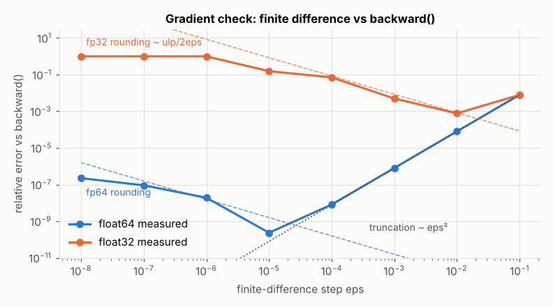
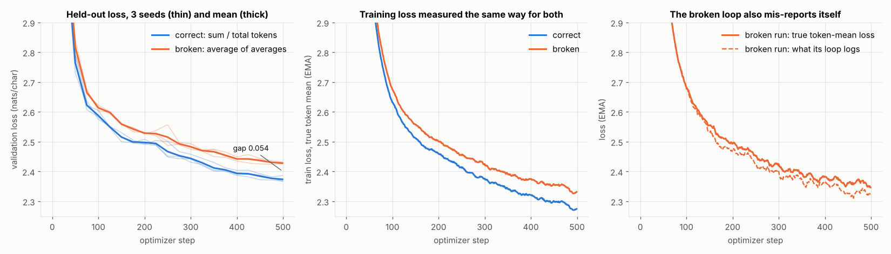
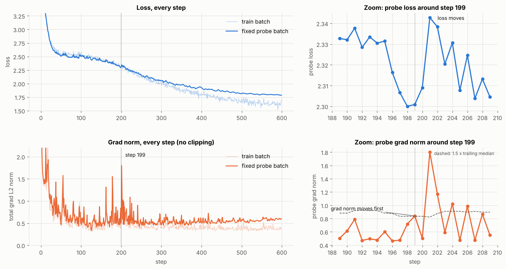
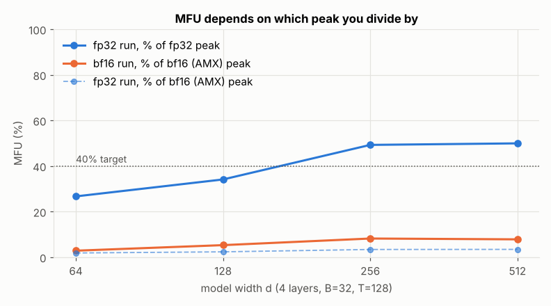
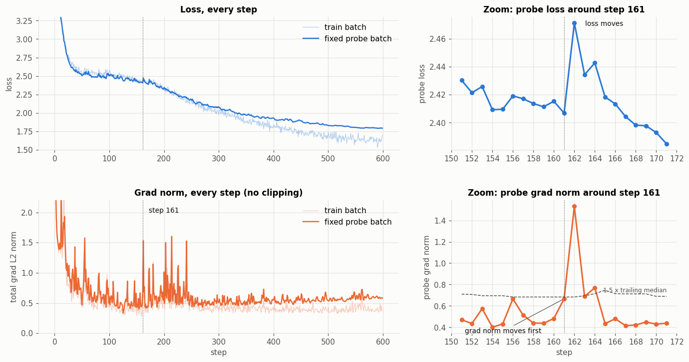
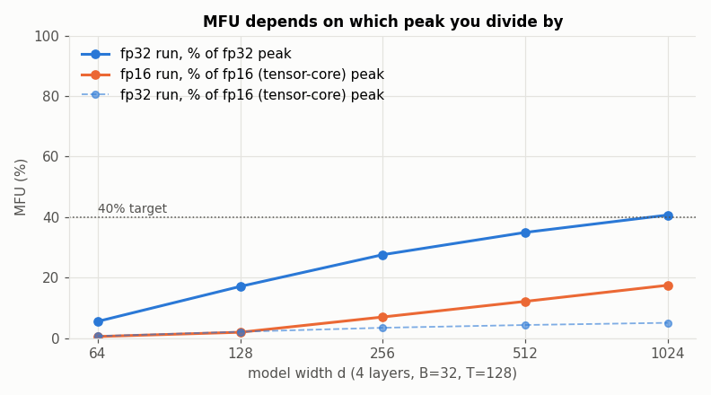

# Training Loop, Under the Microscope

[](https://colab.research.google.com/github/kunal2016/training-loop/blob/main/training_loop.ipynb)

A small GPT and a real training loop on real text, instrumented until it tells the truth about itself. Six experiments, each answering one question you should be able to answer about any training run:

1. What is the shape of every tensor in one step, and what does each dimension mean?
2. Does `backward()` agree with a gradient measured by hand?
3. What does the classic gradient-accumulation bug (averaging per-micro-batch means) actually cost?
4. Does the gradient norm warn you before the loss moves?
5. What is the real MFU, and where does the rest go?
6. What does 0.1 look like, bit by bit, in fp32, bf16 and fp8, and which should you train in?

- **Notebook:** [`training_loop.ipynb`](training_loop.ipynb) — executed top to bottom, all outputs and plots are real.
- **Model:** decoder-only transformer, 4 layers × 4 heads × width 128, pre-LayerNorm, GELU MLP, learned positions — **826,368 parameters**.
- **Data:** Tiny Shakespeare, character level (V = 65), 90/10 train/val split. Downloaded automatically on first run.
- **Hardware (committed run):** CPU only. 2 cores of an Intel Xeon @ 2.1 GHz with AVX-512 and AMX-BF16, PyTorch 2.14.1. The notebook runs end to end in 8–16 minutes, depending on how busy the shared machine is.
- **Also run on a GPU:** the same notebook on a Google Colab **Tesla T4**, committed in [`runs/Tesla-T4_20261005-071659/`](runs/Tesla-T4_20261005-071659/). See [CPU vs GPU](#cpu-vs-gpu-the-same-notebook-on-a-tesla-t4).
- **Runs elsewhere too:** Linux, Windows or macOS, CPU or CUDA GPU, including Google Colab. On CPUs without bf16 hardware (where PyTorch emulates bf16 at a fraction of fp32 speed), the notebook says so and keeps the bf16 measurements short. See [Running it](#running-it).

| Experiment | Result |
|---|---|
| Every tensor shape | all **68** forward activations (meaning per dimension), all **66** activation gradients in backward order, all **53** parameter tensors with grads and AdamW state |
| One gradient by hand | backward `-2.823078916640e-02` vs finite difference `-2.823078917302e-02` — **agree to 9.6 significant digits** (float64) |
| Broken grad accumulation | final val loss **2.374 correct vs 2.428 broken** (gap +0.054 nats, worse on all 3 seeds) |
| Grad norm leads loss | **step 199**: probe grad norm up 77% over two steps with the loss flat; loss jumps +0.042 two steps later |
| MFU | **29.8% of the fp32 peak, but only 2.0% of the hardware's real (bf16/AMX) peak**: I report the latter |
| 0.1 in bits | fp32 `0x3DCCCCCD`, bf16 `0x3DCD`, fp8 E4M3 `0x1D`. I would train in **bf16 mixed precision** |

## Running it

**Locally (CPU or NVIDIA GPU):**

```
pip install -r requirements.txt
jupyter nbconvert --to notebook --execute training_loop.ipynb   # or open it and Run All
```

**On Google Colab (GPU):**

1. Click the **Open in Colab** button at the top of this page. Or, in Colab, use *File → Open notebook → GitHub* and enter `kunal2016/training-loop`.
2. *Runtime → Change runtime type → T4 GPU* (or any GPU you have), then *Runtime → Run all*. Colab already has PyTorch, NumPy and Matplotlib, and the notebook downloads the dataset itself.
3. When the first cell asks, allow access to Google Drive. Outputs are saved there, so they survive the end of the Colab session.

**Where outputs go.** The first cell picks an output folder, so runs on different hardware never overwrite each other:

| where it runs | output folder |
|---|---|
| locally, CPU | the repository itself: `figures/`, `results/`, `run_info.json` (this is the committed run) |
| locally, GPU | `runs/<gpu>_<date-time>/` (git-ignored, except the committed T4 run) |
| Google Colab | Google Drive: `MyDrive/training-loop/runs/<gpu>_<date-time>/` |

Each run folder contains `figures/` (4 PNGs), `results/metrics.json`, `results/main_run_log.json` and `run_info.json` (device, GPU, PyTorch/CUDA versions, time). On Colab it also contains `training_loop_executed.ipynb`, a copy of the notebook with all outputs, saved by the last cell.

**If Colab disconnects mid-run:** the figures are saved as each is drawn, and `results/metrics.json` is re-saved at the end of every section. So everything finished before the cut-off is already in Drive. Its `_progress` entry lists the completed sections and shows `"finished": true` only for a complete run. To recover, press *Run all* again; the new run gets its own folder, and you can delete the partial one. To keep Colab outputs inside the session instead of Drive, set `SAVE_TO_DRIVE = False` in the first cell.

On a GPU the notebook changes a few things automatically:

- Every model and batch lives on the GPU. TF32 is switched off so that "fp32" really is fp32.
- Section 5 takes the peak from a table of published dense specs (H100, A100, L4, T4, V100, …), or from the `PEAK_BF16_TFLOPS` / `PEAK_FP32_TFLOPS` environment variables for anything else. It times with `cuda.synchronize()`, profiles GPU kernel time, and adds a d = 1024 point to the width sweep.
- On GPUs without native bf16 (Colab's free T4, V100), the low-precision runs use **fp16** instead, and every label says so.
- Expect a low MFU for this tiny model on a GPU: each matmul is too small to keep it busy, so kernel-launch overhead dominates. The d = 1024 sweep point shows utilisation recovering.

Training curves on a GPU differ from the committed CPU run in the last bits, so the specific numbers quoted below (step 199 and so on) will be different. The rules that find them are the same.

---

## 1. Every tensor shape in one step

One full step (forward → loss → backward → AdamW) traced with deliberately distinct sizes so no dimension can be confused: **B = 3, T = 16, C = 128, H = 4, hs = 32, 4C = 512, V = 65**. Every tensor goes through a `TRACE(name, tensor, meaning)` call, which also registers a backward hook so activation gradients are logged in the order autograd produces them. The notebook prints **every** tensor: 68 forward activations (15 per block × 4 + 8 outside the blocks), 66 activation gradients, and 53 parameter tensors. It also asserts that blocks 1–3 have exactly block 0's shapes. Block 0 is shown here to keep the README readable:

| tensor | shape | what each dimension means |
|---|---|---|
| `idx` | (3, 16) | B = sequence, T = character position; values are token ids |
| `tok_emb` | (3, 16, 128) | B, T, C = learned vector for that character |
| `pos_emb` | (16, 128) | T, C = learned vector for that position (broadcast over B) |
| `x0` | (3, 16, 128) | B, T, C = residual stream entering block 0 |
| `h0.ln1` | (3, 16, 128) | B, T, C = features normalised per token |
| `h0.attn.qkv` | (3, 16, 384) | B, T, 3C = query \| key \| value features stacked |
| `h0.attn.q` / `k` / `v` | (3, 4, 16, 32) | B, H = head, T = query/key/value position, hs = per-head features |
| `h0.attn.scores` | (3, 4, 16, 16) | B, H, T = query pos (row), T = key pos (col): scaled q·k |
| `h0.attn.probs` | (3, 4, 16, 16) | B, H, T, T: each row is a distribution over the past |
| `h0.attn.y_heads` | (3, 4, 16, 32) | B, H, T, hs = attention-weighted mix of values |
| `h0.attn.y_merged` | (3, 16, 128) | B, T, C = heads concatenated back to width C |
| `h0.attn.out` | (3, 16, 128) | B, T, C = attention update added to the residual |
| `h0.resid_mid` | (3, 16, 128) | B, T, C = residual stream after attention |
| `h0.ln2` | (3, 16, 128) | B, T, C = features normalised per token |
| `h0.mlp.hidden` | (3, 16, 512) | B, T, 4C = expanded hidden features after GELU |
| `h0.mlp.out` | (3, 16, 128) | B, T, C = MLP update added to the residual |
| `h0.resid_out` | (3, 16, 128) | B, T, C = residual stream leaving the block |
| `ln_f` | (3, 16, 128) | B, T, C = final normalised features |
| `logits` | (3, 16, 65) | B, T, V = unnormalised score for each possible next character |
| `targets` | (3, 16) | B, T; true next-character ids (−100 = padding, ignored) |
| `loss` | () | scalar: mean cross-entropy, nats per character |

**Backward:** each activation gradient has exactly its tensor's shape, and dimension *i* of dL/dX means what dimension *i* of X means. Order: `loss[] → logits[3,16,65] → ln_f[3,16,128] → h3.resid_out → … → x0[3,16,128] → pos_emb[16,128] → tok_emb[3,16,128]`. That is 66 gradients: every forward tensor except the integer `idx` and `targets`. All 66 are listed in the notebook.

**Parameters:** `param`, `param.grad`, AdamW `exp_avg` and `exp_avg_sq` all share the parameter's shape (plus a 0-dim step counter). E.g. `tok.weight (65,128)` = one row per character × embedding features; `qkv.weight (384,128)` = 3C outputs × C inputs (`nn.Linear` stores `[out, in]`); `mlp.fc.weight (512,128)`; `mlp.proj.weight (128,512)`; LayerNorm gains/biases `(128,)` = one per feature; `head.weight (65,128)`. All 53 are listed in the notebook.

Things the shapes make obvious: positions are shared across the batch; the (B, H, T, T) attention tensors are the only ones that scale with T² (at training T = 128, one layer's is larger than the whole model); AdamW holds 2× the model in state.

## 2. One gradient verified by hand

Central difference on the largest-gradient entry of `blocks.1.mlp.fc.weight`, a weight deep inside the network, in **float64**, ε = 1e-5:

```
L(w+eps)            = 4.236941925728018
L(w-eps)            = 4.236942490343801
finite difference   = -2.823078917302e-02
backward() reported = -2.823078916640e-02
relative error 2.34e-10  ->  agree to 9.6 significant digits
```

Five more parameter types (token embedding, QKV, attention-projection bias, LayerNorm gain, output head) agree to 7.8–10.4 digits.

**What was worth understanding** — the same check in float32 never gets past 3 digits, and gets *worse* as ε shrinks:



| ε | 1e-1 | 1e-2 | 1e-3 | 1e-4 | 1e-5 | 1e-6 |
|---|---|---|---|---|---|---|
| rel. error, fp64 | 7.9e-3 | 8.0e-5 | 8.0e-7 | 8.1e-9 | **2.3e-10** | 1.9e-8 |
| rel. error, fp32 | 7.8e-3 | **7.7e-4** | 5.0e-3 | 7.1e-2 | 1.6e-1 | 1.0 (FD = 0) |

Truncation error falls as ε²; rounding error grows as ulp(L)/2ε. The loss is ≈ 4.24, where one fp32 ulp is 4.8e-7. At ε = 1e-6 the true loss change (2ε·|g| = 5.6e-8) is smaller than one ulp, so both nudged forward passes return the *same float* and the finite difference is exactly zero. A float32 gradient check that disagrees in the fourth decimal is the arithmetic, not autograd. Gradient checks belong in float64.

A second failure, also shown: with **dropout on**, the "finite difference" comes out as +267 against a true −0.028, because L(w+ε) and L(w−ε) are computed by networks with different random masks. In eval mode it agrees to 2e-10 again.

## 3. Gradient accumulation, broken on purpose

Each optimizer step accumulates **4 micro-batches** of 8 sequences, each micro-batch with its own length drawn log-uniformly from 4 to 128 tokens (realistic variable-length data).

- **Correct:** `(S_k / N).backward()` — S_k is micro-batch k's summed token loss, N the total tokens in the step.
- **Broken (average of averages):** `((S_k / n_k) / K).backward()` — every micro-batch weighs 1/K no matter its size, so a token in a 32-token micro-batch counts 32× a token in a 1,024-token one.

**Deterministic check against ground truth** (all micro-batches in one right-padded batch, one backward on the token mean; micro-batch lengths 85, 6, 10, 8):

| | ‖g − g_ref‖ / ‖g_ref‖ | cosine to g_ref |
|---|---|---|
| correct | **1.5e-7** (float32 round-off) | 1.000000 |
| broken | **0.47** | 0.890 |

The broken weighting leaves an **effective sample of 317 of 872 tokens (36%)**, and the number the broken loop logs (4.2098) is not the loss of the data it trained on (4.2191).

**Training**, identical in every respect except that one line (same init, data, micro-batch order, optimizer, schedule), 3 seeds × 500 steps:



| | seed 0 | seed 1 | seed 2 | mean |
|---|---|---|---|---|
| correct, final val loss | 2.3670 | 2.3682 | 2.3863 | **2.3739** |
| broken, final val loss | 2.4268 | 2.4258 | 2.4323 | **2.4283** |
| gap | +0.060 | +0.058 | +0.046 | **+0.054** |

The correct run reaches the broken run's *final* loss at step 350 of 500 — the bug costs about 30% of the compute. It never crashes or diverges, which is why it survives in real code; with equal-length micro-batches the two formulas coincide, so it hides until padding, packing or variable lengths appear. The right-hand panel shows the second symptom: the broken loop systematically reports a loss lower than the true one.

## 4. Grad norm at every step, and a step where it moved first

Main run: batch 32 × 128, AdamW (0.9, 0.95, wd 0.1), 100-step warmup to a deliberately aggressive **peak LR 1e-2**, cosine decay, **no clipping** (clipping would mute the dynamics), 600 steps → val loss 1.78. The raw total L2 grad norm is logged every step. Because a training-batch loss can rise just because the batch is hard, at every step I also measure loss and grad norm on one **fixed probe batch** before the update: on the probe, any change comes from the weights alone.

The step is found by an explicit rule, not by eye: probe grad norm ≥ 1.5× its trailing 20-step median, probe loss not yet risen (within δ of its 3-step minimum, δ = 2 × robust std of step changes = 0.0127), and a probe-loss rise > 3δ within the next 3 steps. Exactly one step qualifies: **step 199**.



| step | probe grad norm | × baseline | probe loss | Δ loss | |
|---|---|---|---|---|---|
| 197 | 0.474 | 0.85 | 2.3067 | −0.0097 | |
| 198 | 0.716 | 1.29 | 2.3000 | −0.0067 | grad norm climbing |
| **199** | **0.840** | **1.51** | 2.3009 | +0.0008 | **grad norm has moved, loss has not** |
| 200 | 0.505 | 0.91 | 2.3091 | +0.0082 | |
| **201** | 1.800 | 3.28 | **2.3428** | **+0.0338** | **loss moves** |

The grad norm measures the *slope* where the weights are; the loss measures the *height*. At a high learning rate the weights first move into a region where some direction has become steep, and only the next overshooting step turns that into a higher loss.

**Honest caveat:** it is a leading but unreliable signal in this run. Of 18 probe grad-norm jumps almost none are followed by a loss rise; of 7 loss-rise episodes, the grad norm moved strictly first in 2, in the same step in 2, and not at all in 3. A smoke alarm, not a forecast — which is still the reason to log it every step and to clip on it.

## 5. MFU

**Model FLOPs** per token = 6·N (N = non-embedding params incl. the head) + 12·L·T·d for attention (PaLM, App. B). Cross-checked against PyTorch's `FlopCounterMode`: 2.2923e10 vs 2.2753e10 per step (ratio 0.993).

**Peaks** for this machine (2 cores, 2.1 GHz nominal):

| | theoretical | measured 2048² matmul (best of 3) | used |
|---|---|---|---|
| fp32 (AVX-512, 64 FLOP/cycle/core) | 269 GFLOP/s | 294 GFLOP/s (turbo) | **294** |
| bf16 (AMX, 1,024 FLOP/cycle/core [1]) | 4,301 GFLOP/s | 1,736 GFLOP/s | **4,301** |

*Assumption on the AMX peak:* Intel quotes "1,024 bf16 operations per cycle per core" [1]. I count that as 1,024 FLOPs (512 multiply-adds). If Intel meant 1,024 multiply-adds, the peak doubles and every bf16-relative MFU here halves, so my bf16 figures are, if anything, generous. The measured matmul (1,736 GFLOP/s, 40% of 4,301) is a hard lower bound on the peak.

**Measured** (B = 32, T = 128, data loading included; median of 5 timing windows, range in brackets):

| run | tok/s | model GFLOP/s | MFU vs fp32 peak | **MFU vs bf16 peak** |
|---|---|---|---|---|
| fp32 (how I trained) | 15,600 | 87 | 29.8% (26.5–33.0%) | **2.0%** (1.8–2.3%) |
| bf16 autocast | 35,600 | 199 | — | **4.6%** (4.4–4.8%) |
| my actual 600-step run, wall clock | — | 58 | 19.9% | 1.4% (a third of its time went to probe diagnostics) |

Every number above is from the committed run, in `results/metrics.json`. Timing on a shared 2-vCPU VM is noisy: other executions, not committed, gave fp32 figures from about 26% to 43% and bf16-relative figures up to 3.6%. The committed run sits at the low end.



**What I report:** against the fp32 vector peak the fp32 run reaches 29.8%, short of 40%. But the 40% convention comes from GPUs measured against their bf16 tensor-core peak, and this CPU's equivalent, AMX, is 16× its fp32 rate. **My MFU is 2.0%** (4.6% with bf16 autocast).

**What is costing the distance to 40%:**

1. **Precision.** fp32 cannot use AMX at all; fp32 training is capped at 1/16 ≈ 6% of the bf16 peak before anything else.
2. **Tiny matrices.** d = 128, head size 32: AMX tiles get almost no reuse per load and oneDNN spends its time repacking operands. Utilisation climbs with width (2.8% → 8.2% of bf16 peak from d = 64 to 256; the d = 512 point, 7.8%, is within timing noise). Even a big 2048² bf16 matmul reaches only 40% of AMX peak on two cores.
3. **Non-matmul work (Amdahl).** In the profile, matmuls are 53% of op time in fp32 but only **38% in bf16**: once matmuls get faster, copies/masks/indexing (25%), softmax/LayerNorm/GELU/cross-entropy (21%) and other elementwise ops (14%) dominate, and they earn zero model FLOPs.
4. **Unfused attention.** The (B, H, T, T) scores, probabilities and causal mask are materialised in memory; a fused SDPA/FlashAttention kernel would never write them.
5. **Eager-mode overhead.** Dozens of small kernels per layer with Python/dispatcher cost and no `torch.compile` fusion.
6. **Two cores**, no overlap of data loading with compute.

Next steps in order of payoff: bf16 autocast with fp32 master weights, `F.scaled_dot_product_attention`, `torch.compile`, and a wider model or larger micro-batch.

## 6. The number 0.1 in fp32, bf16 and fp8 E4M3

**Binary expansion** (multiply by 2, take the integer part): 0.1 → 0.2(0) → 0.4(0) → 0.8(0) → 1.6(1) → 1.2(1) → 0.4(0) → 0.8(0) → 1.6(1) → 1.2(1) → …
so **0.1 = 0.0001 1001 1001 1001…₂ = 1.1001 1001 1001…₂ × 2⁻⁴**. The pattern repeats forever, so 0.1 is never exact. Sign 0, exponent −4, fraction bits `1001 1001 1001 …`. Each format rounds to nearest (ties to even); in all three the first dropped bits are `11…`, more than half an ulp, so all three **round up**.

**fp32** — 1 | 8 (bias 127) | 23
```
exponent  -4 + 127 = 123            = 01111011
fraction  10011001100110011001100 | 1100...  -> round up -> 10011001100110011001101

0 01111011 10011001100110011001101  = 0x3DCCCCCD = 0.100000001490116119384765625   (rel. err +1.5e-8)
```

**bf16** — 1 | 8 (bias 127) | 7
```
exponent  123                       = 01111011   (same as fp32: same range)
fraction  1001100 | 1100...  -> round up -> 1001101

0 01111011 1001101                  = 0x3DCD     = 205/2048 = 0.10009765625      (rel. err +9.8e-4)
```
(Truncating the fp32 pattern instead would give 0x3DCC = 0.099609375.)

**fp8 E4M3** (OCP "fn": no infinities, max 448) — 1 | 4 (bias 7) | 3
```
exponent  -4 + 7 = 3                = 0011
fraction  100 | 11001...  -> round up -> 101
          (neighbours 1.500x2^-4 = 0.09375 and 1.625x2^-4 = 0.1015625; 0.1 is closer to the second)

0 0011 101                          = 0x1D       = 13/128 = 0.1015625            (rel. err +1.6e-2)
```

All three bit patterns are verified in the notebook by viewing the tensors' raw bits (`torch.float32`, `torch.bfloat16`, `torch.float8_e4m3fn`) and asserting they equal the hand-derived ones.

### Which one I would train in

**bf16 mixed precision**: bf16 for matmul inputs and activations; fp32 master weights, fp32 optimizer state and fp32 reductions.

- **Range.** bf16 has fp32's 8-bit exponent, so gradients and activations practically never overflow or underflow. Unlike fp16 (which turns 70,000 into `inf` and 1e-8 into 0, both shown in the notebook), there is no loss scaling to tune and no skipped steps.
- **Precision is the catch, and the reason for fp32 master weights.** bf16 keeps ~3 significant digits: 0.1 comes back as 0.10009765625, and **1.0 + 0.001 = 1.0 in bf16** (its spacing at 1.0 is 2⁻⁷). A typical update to a weight of size ~1 would vanish. Matmul inputs tolerate this because the products are accumulated in fp32 and the errors average out; the weights themselves cannot.
- **Throughput.** Tensor cores — and AMX on this very machine — run bf16 at 16× the fp32 vector rate. Section 5 is the evidence: fp32 caps MFU at ~6% of the real peak.
- **Not fp8 E4M3.** 0.1 is off by 1.6% and 448 is the largest value. Anything bigger either saturates to 448 or becomes NaN, depending on the converter: PyTorch 2.14 saturates, while the T4 run's PyTorch 2.11 gave NaN. So it needs per-tensor scaling, E5M2 for gradients, and bf16/fp32 for everything else. That pays off for matmuls in very large models on fp8 hardware, not for a 0.8M-parameter model.
- **fp32 everywhere** (what this notebook used) is the right reference for correctness work like the gradient check, but leaves most of the hardware idle.

---

## CPU vs GPU: the same notebook on a Tesla T4

The notebook was run on Google Colab with a **Tesla T4** (PyTorch 2.11, CUDA 13.0). That run used a slightly earlier revision. It differs only in how section 5 handles CPUs without bf16 hardware, which doesn't affect a GPU run, and in some prose fixes. Everything from that run is in [`runs/Tesla-T4_20261005-071659/`](runs/Tesla-T4_20261005-071659/): the executed notebook, four figures, metrics, and `run_info.json`. The T4 has no native bf16, so its low-precision runs use **fp16**.

| | CPU (committed run, 2-vCPU Xeon) | GPU (Tesla T4) |
|---|---|---|
| Whole notebook | ~16 min (8 min on a quieter day) | ~3 min |
| Main 600-step run, wall clock | 236 s | **17 s** |
| One fp32 training step (B=32, T=128) | 262 ms | **15 ms** (~17× faster) |
| Gradient check, agreement with `backward()` | 9.6 digits | 8.7 digits |
| Accumulation: final val loss, correct vs broken | 2.3739 vs 2.4283 | **2.3739 vs 2.4283** (identical, all 3 seeds) |
| Main run, final val loss | 1.7813 | 1.7902 |
| Grad norm before loss | step 199 (strict rule) | step 161 (relaxed rule only; a weaker case, see below) |
| MFU, fp32 run vs fp32 peak | 29.8% | 18.7% |
| MFU, fp32 run vs low-precision peak | 2.0% (bf16/AMX) | 2.3% (fp16 tensor cores, 65 TFLOP/s) |
| Low-precision speed-up of one step | 2.3× (bf16) | **1.06×** (fp16) |
| Matmul share of time, fp32 → low precision | 53% → 38% | 45% → 25% |

**What carries over exactly.** The accumulation experiment gives the same validation losses on both machines to four decimals, so the broken-accumulation gap (+0.054 nats, worse on every seed) is a property of the algorithm, not the hardware. The gradient check agrees to 8.7–9.6 digits on the main weight (7.8–10.4 across the six parameters checked), and the 0.1 bit patterns are identical by construction.

**What changes, and why.**

- **The grad-norm step.** Floating-point results differ in the last bits on a GPU, so the 600-step trajectory differs slightly. No step met the strict rule, so the notebook relaxed it, as designed, and said so in its output. At **step 161** the probe grad norm rose to 1.46× its trailing median while the probe loss *fell* (2.415 → 2.407). On the next step the loss jumped **+0.064 nats**, the largest single-step rise in that stretch, and the grad norm spiked to 1.53 in that same step. This is a weaker case than step 199 on the CPU. It needed the relaxed threshold (1.46× rather than 1.5×), and by the notebook's own strict definition the loss rise at step 162 counts as "same step", not "grad norm first". It is the same shape of event, but not independent confirmation of it.



- **MFU is limited by size, not arithmetic.** At d = 128 each matmul is a few MFLOPs, which a T4 finishes in microseconds. The step is dominated by kernel launches and Python overhead, so switching to fp16 barely helps (15.1 → 14.2 ms). The width sweep shows utilisation recovering as the matrices grow. At d = 1024 the fp32 run reaches **40.7%** of the fp32 peak, and fp16 reaches **11.4 TFLOP/s, 17.5% of the tensor-core peak and 3.4× the fp32 throughput**. That is where tensor cores start to pay off.



| width d | fp32 GFLOP/s | fp16 GFLOP/s | fp16 / fp32 |
|---|---|---|---|
| 64 | 450 | 356 | 0.8× |
| 128 | 1,385 | 1,272 | 0.9× |
| 256 | 2,235 | 4,548 | 2.0× |
| 512 | 2,831 | 7,903 | 2.8× |
| 1024 | 3,296 | 11,363 | 3.4× |

**The conclusion is the same on both machines.** Measured against the hardware's real low-precision peak, this model reaches only a few percent MFU (2.0% CPU, 2.3% GPU). The cure is the same too: bigger matrices, low precision with fp32 master weights, fused attention, and `torch.compile` (plus CUDA graphs on GPU) to remove per-kernel overhead.

## Repository layout

```
training_loop.ipynb      the notebook, executed (CPU run)
README.md                this report
nb_src.txt               plain-text source of every notebook cell, so changes are readable in a diff
build_notebook.py        builds an unexecuted notebook from nb_src.txt (writes training_loop_built.ipynb;
                         refuses to overwrite an executed notebook unless --force)
LICENSE                  MIT
requirements.txt
figures/                 the four plots above
results/metrics.json     every number quoted here
results/main_run_log.json  per-step loss / grad norm / probe metrics for the main run
run_info.json            hardware and software of the committed run
runs/Tesla-T4_20261005-071659/  the Colab T4 run: executed notebook, figures, metrics, run_info.json
runs/                    other run folders are git-ignored
```

## Reproducibility

Training results are bit-for-bit reproducible on the same machine: fixed seeds and a fixed thread count. All ten full executions on it gave identical losses, gradients and the same step 199.

Timing-based numbers (tokens/s, MFU) are not reproducible to the decimal. They move by up to ±15% between executions on a shared VM, so section 5 reports medians and ranges.

On different hardware (another CPU, a GPU, a different PyTorch version), floating-point results differ in the last bits, and the training curves will differ slightly. The notebook's rules still apply and pick their own values. For example, section 4 finds its own "grad norm before loss" step with the same rule, and falls back to a slightly relaxed threshold, which it announces, if nothing meets the strict one. That is what happened on the Colab T4 (step 161), where the result is correspondingly weaker. The specific values quoted in the notebook's prose and in this README (step 199, the 0.474 → 0.840 rise, the MFU figures) come from the committed run.

[1] Intel Architecture Day 2021: AMX performs 1,024 bf16 operations per cycle per core, vs 64 with AVX-512. https://edc.intel.com/content/www/us/en/products/performance/benchmarks/architecture-day-2021/

## License

MIT. See [LICENSE](LICENSE).
